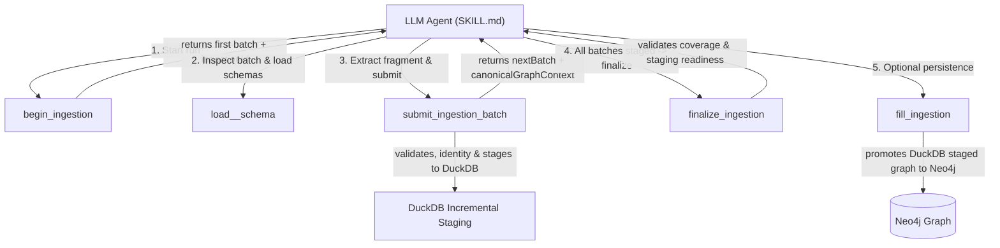

# Ingestion Service — Skill-Driven Incremental Staging Architecture V2

Package này cung cấp các **deterministic primitives** cho **Ingestion LLM Skill** (`app/skills/ingestion/SKILL.md`).

Theo thiết kế V2:
- **SKILL.md sở hữu toàn bộ orchestration/decision flow**: quyết định bước tiếp theo, chọn/load Schema Skill dynamically (`load_<domain>_schema`), trích xuất ngữ nghĩa (semantic mapping), phát hiện lỗi & retry/repair batch, và quyết định thời điểm finalize/fill.
- **Python code sở hữu các primitives deterministic**: chuẩn bị tài liệu (document/chunking), chia batch (workspace), validate fragment (patch/validation), định danh node (identity), lưu trữ tạm thời tăng tiến trên DuckDB (incremental staging), và ghi Neo4j (persistence). Không còn runner end-to-end, `SchemaRouter`, hay retry loop bằng Python.

## Sơ đồ luồng V2

## Bản đồ package

| Package | Trách nhiệm | Interfaces chính |
| --- | --- | --- |
| `ontology/` | Nạp ontology JSON, tra cứu class/property/edge, validate datatype | `OntologyLoader`, `OntologyRegistry`, `XsdDatatype` |
| `document/` | Đọc tài liệu, chuẩn hoá Markdown, chia chunk có ngữ cảnh | `DocumentReader`, `DocumentPreparation` |
| `workspace/` | Quản lý phiên ingestion, chia batch, gộp fragment | `IngestionWorkspaceService`, `IngestionWorkspace`, `IngestionBatch` |
| `patch/` | Biên dịch draft thành patch chuẩn hoá, chốt chặn fragment | `GraphPatchCompiler`, `GraphFragmentGuard` |
| `validation/` | Kiểm định nguồn (evidence grounding) và ontology | `GraphValidation` |
| `incremental/` | Persistent staging (DuckDB), identity resolution, candidate retrieval | `IngestionStagingStore`, `decompose_fragment`, `resolve_pending_edges` |
| `persistence/` | Ghi node/edge xuống Neo4j từ persistent staging, readback & verification | `GraphPersistence`, `Neo4jGraphStore`, `SourceLifecycleStore` |
| `orchestration/` | Pure deterministic helpers cho session state, artifact prep, context formatting & stats | `load_and_prepare_artifact_context`, `_batch_payload`, `_store_workspace` |
| `identity/` | Định danh node tự nhiên & ngữ nghĩa | `IdentityResolver`, `SemanticEntityResolver` |

## Kiến trúc Incremental Persistent Staging V2

### Architectural Invariants

1. **`GraphPatchFragment` chỉ là batch-local payload**: Fragment chỉ tồn tại trong 1 lượt submit batch. Sau khi `submit_ingestion_batch` phân rã và lưu vào DuckDB persistent staging, fragment sẽ được giải phóng khỏi model reasoning.
2. **`canonicalGraphContext` cung cấp ngữ cảnh entity đã stage**: Mỗi `nextBatch` trả về `canonicalGraphContext` chứa các entity liên quan đã được stage từ các batch trước để Agent chủ động reuse.
3. **Deterministic Identity & Staging**: Việc gộp node, resolve alias, pending edge và kiểm tra conflict được xử lý deterministic tại tầng Python Staging Store (DuckDB).

