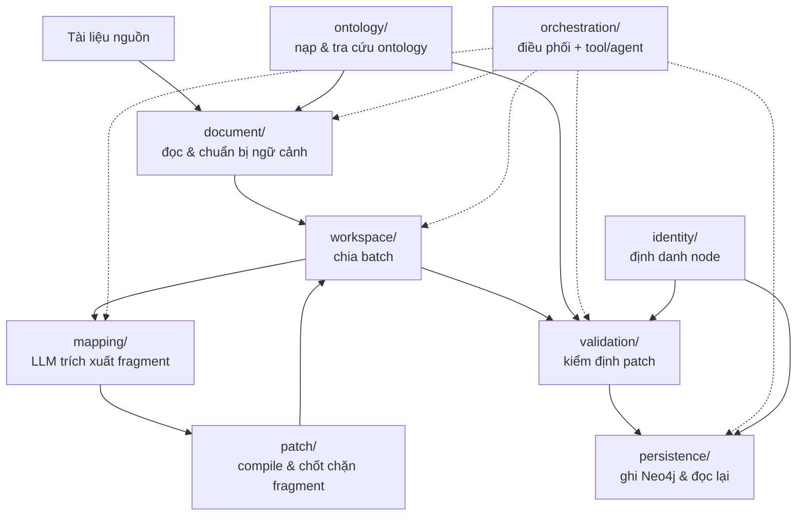

# Ingestion service — kiến trúc theo phase

Package này biến một tài liệu nghiệp vụ (markdown/text) thành Knowledge Graph trên
Neo4j. Trước đây toàn bộ logic nằm trong 18 file phẳng ở `app/services/ingestion/`;
nay được gom thành các package con theo **phase của pipeline**, mỗi package có một
interface công khai riêng (re-export qua `__init__.py`).

## Sơ đồ phase

## Bản đồ package

| Package | Phase | Trách nhiệm | Interface chính |
| --- | --- | --- | --- |
| `ontology/` | 0 | Nạp ontology JSON, tra cứu class/property/edge, kiểm tra kiểu XSD | `OntologyLoader`, `OntologyRegistry`, `XsdDatatype` |
| `document/` | 1 | Đọc file/upload thành chunk, ghép với ontology thành ngữ cảnh extraction | `DocumentReader`, `DocumentPreparation` |
| `mapping/` | 2 | Gọi LLM trích xuất graph patch, giữ nhịp & retry khi gọi model | `AdkGraphMapper`, `AdkStructuredCallExecutor` |
| `workspace/` | 2b | Chia tài liệu thành batch, nhận & gộp fragment theo phiên | `IngestionWorkspaceService` |
| `patch/` | 3 | Biên dịch draft thành patch chuẩn hoá, chốt chặn fragment | `GraphPatchCompiler`, `GraphFragmentGuard` |
| `validation/` | 4 | Kiểm định nguồn (grounding) và ontology trước khi ghi | `GraphValidation` |
| `persistence/` | 5 | Ghi node/edge xuống Neo4j, đọc lại để xác minh | `GraphPersistence`, `Neo4jGraphStore` |
| `orchestration/` | 6 | Điều phối end-to-end, quản lý session state, các bước tool | `IngestionUseCase`, `tools` |
| `identity/` | — | Định danh node dùng chung cho validation và persistence | `IdentityResolver` |

## Luồng chạy một tài liệu

1. `orchestration.tools.prepare_extraction_context` — đọc artifact, cắt chunk, lưu
   `ExtractionContext` vào session state.
2. `begin_ingestion` — tạo `IngestionWorkspace` và chia batch.
3. Với mỗi batch: `mapping.AdkGraphMapper.map_batch` sinh fragment →
   `patch.GraphFragmentGuard.canonicalize/validate` chốt chặn →
   `submit_ingestion_batch` gộp vào workspace. Batch sau nhận ngữ cảnh graph rút gọn
   từ `orchestration.context`.
4. `finalize_ingestion` — gộp patch, chạy `validation.GraphValidation.assess`; nếu
   còn chunk thiếu coverage thì `orchestration.coverage` yêu cầu model trích xuất lại.
5. `fill_ingestion` — `persistence.GraphPersistence.fill` ghi xuống Neo4j, đọc lại và
   trả receipt (`orchestration.receipts`).

`ingest_document_end_to_end` gói toàn bộ các bước trên trong một lời gọi.

## Quy ước khi thêm/sửa code

- **Docstring tiếng Việt** cho mọi module, class, hàm/method (kể cả hàm private):
  nêu chức năng, `Args`/`Returns`/`Raises` khi cần. Comment inline giải thích "vì sao",
  không mô tả lại điều code đã nói rõ.
- **Import nội bộ**: trỏ tới module cụ thể (`from ...patch.compiler import X`).
  Không import qua `__init__` của package con khác để tránh vòng import; `__init__.py`
  chỉ dành cho caller bên ngoài package.
- **Interface của package là `__init__.py`**: caller ngoài (tool, test, script) nên
  import từ đó. Muốn đổi cách chia file bên trong thì giữ nguyên phần re-export.
- **Giữ nguyên chữ ký hàm và message/log/prompt** khi refactor cấu trúc: prompt là
  một phần hành vi của hệ thống.
- Một ngoại lệ có chủ đích: `orchestration/coverage.py` import
  `submit_ingestion_batch` **trong thân hàm** để phá vòng import `tools ↔ coverage`.

## Ghi chú lịch sử

Các module phẳng cũ (`use_case.py`, `graph_validation.py`, `graph_patch_compiler.py`,
`adk_graph_mapper.py`, `staged_ingestion.py`, `neo4j_*.py`, ...) đã được thay thế hoàn
toàn. Không còn đường dẫn import cũ nào trong repo; nếu gặp tài liệu/tool cũ nhắc tới
chúng, hãy ánh xạ theo bảng trên.
