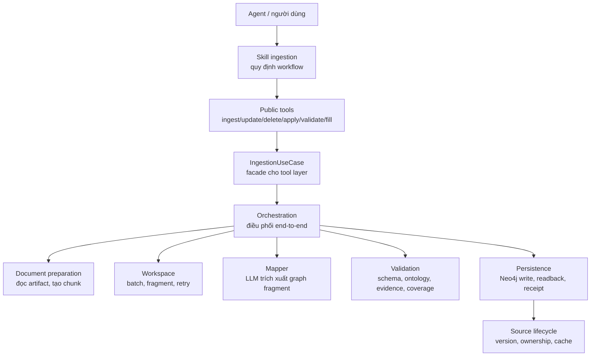
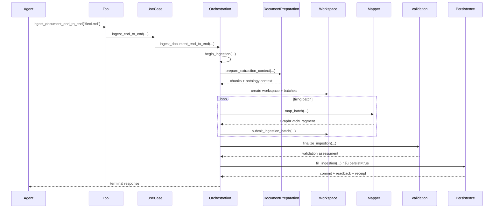
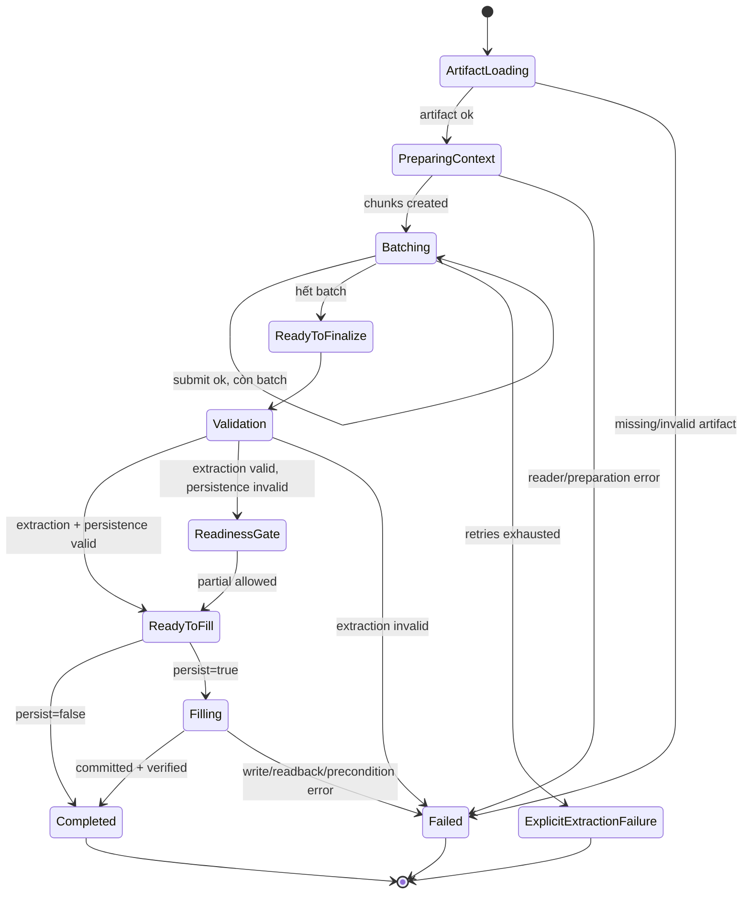

# Walkthrough Chi Tiết Luồng Skill Ingestion

## 1. Mục Đích Và Cách Đọc

Tài liệu này là bản walkthrough chi tiết cho skill ingestion. Khác với tài liệu thiết kế tổng quan, file này đi từng bước một theo đúng luồng chạy: tool nào được gọi, hàm nào xử lý, đầu vào là gì, output thường trông như thế nào, và khi lỗi thì dừng ở đâu.

Quy ước trình bày:

- Tên hàm/tool luôn đi kèm chức năng tiếng Việt.
- Ví dụ output là mẫu minh họa rút gọn, không phải payload đầy đủ tuyệt đối.
- Các ví dụ chunk, batch, patch dùng dữ liệu giả lập gần với tài liệu sản phẩm ngân hàng.
- Mục tiêu là giúp engineer/reviewer hiểu luồng skill nhanh mà vẫn đủ chi tiết để debug.

## 2. Bản Đồ Tầng Xử Lý



| Tầng | Chức năng tiếng Việt | Thành phần/hàm tiêu biểu |
| --- | --- | --- |
| Skill | Quy định agent phải dùng luồng nào, không được tự bypass validation | `app/skills/ingestion/SKILL.md` |
| Public tools | Các tool agent gọi trực tiếp | `ingest_document_end_to_end`, `update_document`, `delete_document` |
| Facade | Giữ interface ổn định cho tool layer | `IngestionUseCase` - lớp bọc nghiệp vụ ingestion |
| Orchestration | Điều phối toàn bộ pipeline, state, retry, terminal response | `begin_ingestion`, `finalize_ingestion`, `fill_ingestion` |
| Document | Đọc artifact, chia chunk, dựng ontology context | `prepare_extraction_context`, `DocumentPreparation.prepare_uploaded_document` |
| Mapping | Gọi LLM trích xuất fragment | `map_batch` - trích xuất graph cho một batch |
| Validation | Kiểm định extraction và điều kiện ghi | `GraphValidation.assess` |
| Persistence | Ghi Neo4j, readback, receipt | `_persist_with_receipt`, `fill_ingestion` |

## 3. Danh Sách Tool/Hàm Chính

| Tên | Chức năng tiếng Việt | Input chính | Output chính |
| --- | --- | --- | --- |
| `ingest_document_end_to_end` | Chạy ingestion trọn pipeline cho một artifact | `artifact_name`, `persist`, `allow_partial_persistence` | Terminal result: completed/validation/readiness/error |
| `update_document` | Cập nhật tài liệu logic đã ingest | `artifact_name`, `if_missing` | Kết quả ingest kèm `operation=update` |
| `delete_document` | Xóa ownership nguồn và cleanup facts không còn hỗ trợ | `artifact_name`, `if_missing` | Kết quả delete source lifecycle |
| `apply_changes` | Đồng bộ danh sách added/modified/deleted | 3 list file | Per-source result |
| `validate_graph_patch` | Kiểm định patch caller cung cấp, không ghi | `GraphPatchDraft` | Validation result + gate fingerprint nếu valid |
| `fill_graph_patch` | Ghi patch đã validate trong cùng phiên | `GraphPatchDraft` | Persistence result |
| `prepare_extraction_context` | Load artifact, tính digest, dựng chunk/context | `artifact_name`, runtime | `chunkCount`, `sourceChunks`, ontology context |
| `begin_ingestion` | Tạo workspace và batch đầu tiên | `artifact_name`, runtime | `ingestionId`, `nextBatch` |
| `map_batch` | LLM trích xuất graph fragment từ batch | batch payload, chunks, graph context | `GraphPatchFragment` |
| `submit_ingestion_batch` | Nộp fragment vào workspace, trả batch tiếp theo | ingestion id, batch index, fragment | `batching` hoặc `ready_to_finalize` |
| `finalize_ingestion` | Merge fragment và validate toàn bộ patch | ingestion id | `ready_to_fill`, `readiness_gate`, hoặc `validation` |
| `fill_ingestion` | Ghi patch đã finalize xuống Neo4j | ingestion id | Commit/readback/receipt result |

## 4. Luồng Chính Ingest End-To-End



### 4.1. Bước 1 - Agent gọi public tool

Hàm/tool: `ingest_document_end_to_end` - chạy ingestion trọn pipeline.

Input ví dụ:

```json
{
  "artifact_name": "FLEXI_REWARDS.md",
  "persist": true,
  "allow_partial_persistence": false,
  "max_retries_per_batch": 3
}
```

Ý nghĩa:

- `artifact_name`: tên artifact trong ADK runtime.
- `persist=true`: sau khi validate sẽ ghi Neo4j.
- `allow_partial_persistence=false`: không ghi nếu chưa đủ readiness.
- `max_retries_per_batch=3`: mỗi batch được thử sửa tối đa 3 lần.

Output chuyển tiếp: public tool gọi `IngestionUseCase.ingest_end_to_end`.

### 4.2. Bước 2 - Facade chuyển request

Hàm: `IngestionUseCase.ingest_end_to_end` - lớp facade chuyển request từ tool sang orchestration.

Input: giống public tool.

Output: gọi orchestration `ingest_document_end_to_end`.

Vai trò:

- Giữ API ổn định cho tool layer.
- Che giấu chi tiết batch/workspace/validation/persistence.

### 4.3. Bước 3 - Orchestration bắt đầu pipeline

Hàm: orchestration `ingest_document_end_to_end` - điều phối toàn bộ ingestion.

Các việc chính:

1. Gọi `begin_ingestion`.
2. Lặp qua các batch.
3. Gọi mapper để trích xuất fragment.
4. Submit fragment vào workspace.
5. Finalize và validate patch cuối.
6. Nếu `persist=true`, gọi fill để ghi Neo4j.
7. Trả terminal response.

Output lỗi sớm ví dụ nếu begin thất bại:

```json
{
  "success": false,
  "stage": "artifact_loading",
  "terminal": true,
  "error": "Artifact not found: FLEXI_REWARDS.md"
}
```

## 5. Chuẩn Bị Artifact, Chunk Và Workspace

### 5.1. Bước 4 - `begin_ingestion`

Hàm: `begin_ingestion` - bắt đầu phiên ingestion, chuẩn bị ngữ cảnh và tạo workspace.

Input:

```json
{
  "artifact_name": "FLEXI_REWARDS.md"
}
```

Các bước nội bộ:

1. Gọi `prepare_extraction_context`.
2. Nếu prepare fail, trả lỗi ngay.
3. Lấy `sourceChunks` trong session state.
4. Gọi workspace service để chia batch.
5. Lưu workspace vào session state.
6. Trả batch đầu tiên.

Output thành công ví dụ:

```json
{
  "success": true,
  "stage": "batching",
  "terminal": false,
  "ingestionId": "ing_8f34c1a2",
  "chunkCount": 6,
  "batchCount": 2,
  "documentId": "doc-flexi-rewards",
  "sourceVersionId": "srcv_20260910_abcd",
  "nextBatch": {
    "batchIndex": 0,
    "chunkIndexes": [0, 1, 2],
    "chunks": [
      {
        "index": 0,
        "source": "FLEXI_REWARDS.md",
        "section": "Thông tin tài liệu",
        "content": "# Thông tin tài liệu\nTên tài liệu: Hướng dẫn nghiệp vụ sản phẩm thẻ tín dụng Flexi Rewards"
      }
    ]
  }
}
```

### 5.2. Bước 5 - `prepare_extraction_context`

Hàm: `prepare_extraction_context` - load artifact, tính digest, clear state cũ, chuẩn bị chunks và ontology context.

Các bước chi tiết:

| # | Xử lý | Output/ghi chú |
| --- | --- | --- |
| 1 | Clear validation gate cũ | Xóa fingerprint validate cũ để không fill nhầm |
| 2 | Xóa state cũ | Xóa artifact name, digest, document id, source chunks, workspace |
| 3 | Load artifact từ runtime | Nhận bytes hoặc text |
| 4 | Kiểm tra artifact có dữ liệu | Nếu không có bytes/text thì `artifact_loading` failed |
| 5 | Tính SHA-256 digest | Dùng cho fingerprint patch |
| 6 | Gọi `DocumentPreparation.prepare_uploaded_document` | Sinh chunks + ontology context |
| 7 | Lưu chunks vào session state | Validation/fill cần source chunks |
| 8 | Trả context payload | Có chunk count, document id, signatures |

Input artifact minh họa:

```markdown
# Thông tin sản phẩm

Tên sản phẩm: Thẻ tín dụng Flexi Rewards
Mã sản phẩm: CC-FLEXI-001
Ngày hiệu lực: 01/08/2026

## Điều kiện khách hàng

- Khách hàng cá nhân từ 18 tuổi.
- Thu nhập tối thiểu 10.000.000 VND/tháng.

## Hồ sơ yêu cầu

| Tên hồ sơ | Bắt buộc |
| --- | --- |
| CCCD/CMND | Có |
| Sao kê lương 3 tháng | Có |
```

Output rút gọn:

```json
{
  "success": true,
  "stage": "completed",
  "chunkCount": 3,
  "documentId": "doc-flexi-rewards",
  "artifactDigest": "sha256:...",
  "chunks": [
    {
      "index": 0,
      "source": "FLEXI_REWARDS.md",
      "section": "Thông tin sản phẩm",
      "content": "Tên sản phẩm: Thẻ tín dụng Flexi Rewards\nMã sản phẩm: CC-FLEXI-001\nNgày hiệu lực: 01/08/2026"
    }
  ],
  "ontologyContext": "CLASS: pskg:BankingProduct\nPROPERTIES:\n  - pskg:productCode ..."
}
```

### 5.3. Ví dụ chia chunk thế nào

Reader ưu tiên giữ cấu trúc Markdown theo section. Một tài liệu có heading và bảng thường được chia theo các khối có nghĩa:

Input:

```markdown
# Thông tin sản phẩm
Tên sản phẩm: Thẻ tín dụng Flexi Rewards
Mã sản phẩm: CC-FLEXI-001

## Điều kiện khách hàng
- Khách hàng cá nhân từ 18 tuổi.
- Thu nhập tối thiểu 10.000.000 VND/tháng.

## Hồ sơ yêu cầu
| Tên hồ sơ | Bắt buộc |
| --- | --- |
| CCCD/CMND | Có |
| Sao kê lương 3 tháng | Có |
```

Chunks minh họa:

```json
[
  {
    "index": 0,
    "source": "FLEXI_REWARDS.md",
    "section": "Thông tin sản phẩm",
    "structuralPath": "Thông tin sản phẩm",
    "startLine": 1,
    "endLine": 3,
    "content": "Tên sản phẩm: Thẻ tín dụng Flexi Rewards\nMã sản phẩm: CC-FLEXI-001"
  },
  {
    "index": 1,
    "source": "FLEXI_REWARDS.md",
    "section": "Điều kiện khách hàng",
    "structuralPath": "Điều kiện khách hàng",
    "startLine": 5,
    "endLine": 7,
    "content": "- Khách hàng cá nhân từ 18 tuổi.\n- Thu nhập tối thiểu 10.000.000 VND/tháng."
  },
  {
    "index": 2,
    "source": "FLEXI_REWARDS.md",
    "section": "Hồ sơ yêu cầu",
    "structuralPath": "Hồ sơ yêu cầu",
    "startLine": 9,
    "endLine": 13,
    "content": "| Tên hồ sơ | Bắt buộc |\n| --- | --- |\n| CCCD/CMND | Có |\n| Sao kê lương 3 tháng | Có |"
  }
]
```

Điểm cần chú ý:

- `index` là khóa để validation kiểm tra coverage/evidence.
- `section` giúp evidence truy vết dễ hơn.
- Với bảng Markdown, nội dung bảng cần giữ nguyên dấu `|` để evidence match chính xác.

### 5.4. Ví dụ chia batch từ chunks

Nếu có 6 chunks và cấu hình workspace chia 3 chunks/batch, output workspace có thể như sau:

```json
{
  "ingestionId": "ing_8f34c1a2",
  "chunkCount": 6,
  "batchCount": 2,
  "batches": [
    {
      "batchIndex": 0,
      "chunkIndexes": [0, 1, 2]
    },
    {
      "batchIndex": 1,
      "chunkIndexes": [3, 4, 5]
    }
  ]
}
```

Batch payload trả cho mapper:

```json
{
  "batchIndex": 0,
  "chunkIndexes": [0, 1, 2],
  "chunks": [
    {"index": 0, "section": "Thông tin sản phẩm", "content": "..."},
    {"index": 1, "section": "Điều kiện khách hàng", "content": "..."},
    {"index": 2, "section": "Hồ sơ yêu cầu", "content": "..."}
  ],
  "ontologyContext": "CLASS: pskg:BankingProduct ..."
}
```

## 6. Luồng Preprocessing

Hàm: `MarkdownPreprocessor.preprocess` - làm sạch, chuẩn hóa, chống trùng và validate Markdown.

| Step | Tên xử lý | Chức năng tiếng Việt | Ví dụ trước | Ví dụ sau |
| --- | --- | --- | --- | --- |
| 1 | `exact_line_dedup` | Xóa dòng thô bị lặp y hệt | `Mã SP: A\nMã SP: A` | `Mã SP: A` |
| 2 | `clean_markdown` | Dọn khoảng trắng/formatting rác | `Tên   SP :  Flexi` | `Tên SP: Flexi` |
| 3 | `normalize_markdown` | Chuẩn hóa alias/value | `Mã SP: CC-FLEXI-001` | `Mã sản phẩm: CC-FLEXI-001` |
| 4 | `normalized_line_dedup` | Dedup sau normalize | `Mã SP...` và `Mã sản phẩm...` | Một dòng chuẩn |
| 5 | `semantic_fact_dedup` | Dedup fact cùng nghĩa | Hai dòng cùng mã sản phẩm | Một fact |
| 6 | `section_dedup` | Dedup section trùng | Hai section "Hồ sơ yêu cầu" giống nhau | Một section |
| 7 | `clean_markdown` lần hai | Dọn format sau transform | Bảng bị thừa khoảng trắng | Bảng ổn định hơn |
| 8 | `validate_markdown` | Kiểm tra cấu trúc/rule/conflict | Hai ngày hiệu lực mâu thuẫn | Warning/error conflict |
| 9 | `document_dedup_index.check_and_add` | Kiểm tra trùng toàn tài liệu | Nội dung đã ingest | Warning duplicate |

Ví dụ input preprocessing:

```markdown
Tên SP:  Flexi Rewards
Mã SP: CC-FLEXI-001
Mã sản phẩm: CC-FLEXI-001

## Hồ sơ yêu cầu
| Tên hồ sơ | Bắt buộc |
| CCCD | Có |
```

Output minh họa:

```json
{
  "processedText": "Tên sản phẩm: Flexi Rewards\nMã sản phẩm: CC-FLEXI-001\n\n## Hồ sơ yêu cầu\n| Tên hồ sơ | Bắt buộc |\n| CCCD | Có |",
  "validation": {
    "isValid": true,
    "errors": [],
    "warnings": []
  },
  "duplicateDocument": false
}
```

## 7. Mapping Batch Và Submit Batch

### 7.1. `map_batch` - trích xuất graph fragment

Input cho `map_batch`:

```json
{
  "batch_payload": {
    "batchIndex": 0,
    "chunkIndexes": [0, 1, 2]
  },
  "chunks": [
    {
      "index": 0,
      "section": "Thông tin sản phẩm",
      "content": "Tên sản phẩm: Thẻ tín dụng Flexi Rewards\nMã sản phẩm: CC-FLEXI-001"
    },
    {
      "index": 1,
      "section": "Điều kiện khách hàng",
      "content": "- Khách hàng cá nhân từ 18 tuổi."
    }
  ],
  "graph_context": "",
  "previous_error": null
}
```

Output `GraphPatchFragment` minh họa:

```json
{
  "nodes": [
    {
      "tempId": "product-flexi",
      "className": "pskg:BankingProduct",
      "properties": [
        {
          "propertyName": "pskg:productName",
          "value": "Thẻ tín dụng Flexi Rewards",
          "evidence": [
            {
              "source": "FLEXI_REWARDS.md",
              "chunkIndex": 0,
              "section": "Thông tin sản phẩm",
              "text": "Tên sản phẩm: Thẻ tín dụng Flexi Rewards"
            }
          ]
        },
        {
          "propertyName": "pskg:productCode",
          "value": "CC-FLEXI-001",
          "evidence": [
            {
              "source": "FLEXI_REWARDS.md",
              "chunkIndex": 0,
              "section": "Thông tin sản phẩm",
              "text": "Mã sản phẩm: CC-FLEXI-001"
            }
          ]
        }
      ],
      "evidence": [
        {
          "source": "FLEXI_REWARDS.md",
          "chunkIndex": 0,
          "section": "Thông tin sản phẩm",
          "text": "Tên sản phẩm: Thẻ tín dụng Flexi Rewards"
        }
      ],
      "confidence": 0.96
    },
    {
      "tempId": "rule-age-18",
      "className": "pskg:BusinessRule",
      "properties": [
        {
          "propertyName": "pskg:ruleDescription",
          "value": "Khách hàng cá nhân từ 18 tuổi.",
          "evidence": [
            {
              "source": "FLEXI_REWARDS.md",
              "chunkIndex": 1,
              "section": "Điều kiện khách hàng",
              "text": "- Khách hàng cá nhân từ 18 tuổi."
            }
          ]
        }
      ],
      "evidence": [
        {
          "source": "FLEXI_REWARDS.md",
          "chunkIndex": 1,
          "section": "Điều kiện khách hàng",
          "text": "- Khách hàng cá nhân từ 18 tuổi."
        }
      ],
      "confidence": 0.9
    }
  ],
  "edges": [
    {
      "edgeName": "pskg:hasEligibilityRule",
      "sourceTempId": "product-flexi",
      "targetTempId": "rule-age-18",
      "evidence": [
        {
          "source": "FLEXI_REWARDS.md",
          "chunkIndex": 1,
          "section": "Điều kiện khách hàng",
          "text": "- Khách hàng cá nhân từ 18 tuổi."
        }
      ],
      "confidence": 0.88
    }
  ],
  "coverage": [
    {
      "chunkIndex": 0,
      "decision": "MAPPED",
      "reason": "Thông tin định danh sản phẩm"
    },
    {
      "chunkIndex": 1,
      "decision": "MAPPED",
      "reason": "Điều kiện đủ điều kiện khách hàng"
    }
  ],
  "warnings": []
}
```

### 7.2. `submit_ingestion_batch` - nộp fragment

Input:

```json
{
  "ingestion_id": "ing_8f34c1a2",
  "batch_index": 0,
  "graph_fragment": "{GraphPatchFragment ở trên}"
}
```

Output nếu còn batch:

```json
{
  "success": true,
  "stage": "batching",
  "terminal": false,
  "ingestionId": "ing_8f34c1a2",
  "processedBatches": 1,
  "remainingBatches": 1,
  "fragmentStats": {
    "nodes": 2,
    "edges": 1,
    "coverage": 2
  },
  "nextBatch": {
    "batchIndex": 1,
    "chunkIndexes": [3, 4, 5]
  }
}
```

Output nếu hết batch:

```json
{
  "success": true,
  "stage": "ready_to_finalize",
  "terminal": false,
  "ingestionId": "ing_8f34c1a2",
  "processedBatches": 2,
  "remainingBatches": 0
}
```

Output nếu conflict:

```json
{
  "success": false,
  "stage": "batch_validation",
  "terminal": false,
  "batchIndex": 1,
  "retryRequired": true,
  "nextAction": "remap_same_batch",
  "errors": [
    {
      "code": "BATCH_CONFLICT",
      "message": "Conflicting scalar value for canonical product node",
      "location": "batches.1"
    }
  ]
}
```

## 8. Finalize, Validation Và Gate Ghi Dữ Liệu

### 8.1. `finalize_ingestion` - merge và validate toàn bộ patch

Input:

```json
{
  "ingestion_id": "ing_8f34c1a2"
}
```

Các bước:

1. Kiểm tra workspace còn tồn tại.
2. Kiểm tra không còn batch pending.
3. Merge toàn bộ fragment thành patch cuối.
4. Gọi `GraphValidation.assess`.
5. Nếu `validForExtraction=true`, lưu finalized patch.
6. Nếu `validForPersistence=true`, lưu validated fingerprint.
7. Trả public assessment.

Output hợp lệ để ghi:

```json
{
  "success": true,
  "stage": "ready_to_fill",
  "terminal": false,
  "ingestionId": "ing_8f34c1a2",
  "validForExtraction": true,
  "validForPersistence": true,
  "fingerprint": "fp_9d2c...",
  "errors": [],
  "warnings": []
}
```

Output extraction đúng nhưng chưa đủ readiness:

```json
{
  "success": true,
  "stage": "readiness_gate",
  "terminal": true,
  "validForExtraction": true,
  "validForPersistence": false,
  "errors": [
    {
      "code": "IDENTITY_UNRESOLVED",
      "message": "Cannot resolve stable identity for required document node",
      "location": "nodes.4"
    }
  ]
}
```

Output extraction sai:

```json
{
  "success": false,
  "stage": "validation",
  "terminal": true,
  "validForExtraction": false,
  "validForPersistence": false,
  "errors": [
    {
      "code": "COVERAGE_MISSING",
      "message": "Missing coverage decision for chunk 2",
      "location": "coverage"
    }
  ]
}
```

### 8.2. Validation kiểm tra gì

| Nhóm kiểm tra | Ví dụ lỗi | Ý nghĩa |
| --- | --- | --- |
| Schema | Field thừa trong node | Patch không đúng contract |
| Technical name | `productCode` thay vì `pskg:productCode` | Tên ontology không đầy đủ |
| Domain/range | Edge nối sai loại node | Quan hệ không hợp ontology |
| Datatype | Date không parse được | Value không đúng kiểu |
| Evidence | Text không tồn tại trong chunk | Fact không bám nguồn |
| Coverage | Thiếu chunk hoặc `MAPPED` không có evidence | Tài liệu chưa được xét đủ |
| Identity | Không định danh được node | Chưa đủ điều kiện persistence |
| Persistence rule | Thiếu thuộc tính/quan hệ bắt buộc | Không ghi mặc định |

### 8.3. Ví dụ coverage đúng/sai

Đúng:

```json
[
  {"chunkIndex": 0, "decision": "MAPPED", "reason": "Thông tin sản phẩm"},
  {"chunkIndex": 1, "decision": "MAPPED", "reason": "Điều kiện khách hàng"},
  {"chunkIndex": 2, "decision": "MAPPED", "reason": "Hồ sơ yêu cầu"}
]
```

Sai vì thiếu chunk 2:

```json
[
  {"chunkIndex": 0, "decision": "MAPPED", "reason": "Thông tin sản phẩm"},
  {"chunkIndex": 1, "decision": "MAPPED", "reason": "Điều kiện khách hàng"}
]
```

Sai vì `MAPPED` nhưng không có evidence nào dùng chunk 1:

```json
{
  "coverage": [
    {"chunkIndex": 1, "decision": "MAPPED", "reason": "Điều kiện khách hàng"}
  ],
  "nodes": [
    {
      "tempId": "product-flexi",
      "evidence": [{"chunkIndex": 0, "text": "Tên sản phẩm: ..."}]
    }
  ]
}
```

## 9. Fill Và Persistence

### 9.1. `fill_ingestion` - ghi workspace đã finalize

Input:

```json
{
  "ingestion_id": "ing_8f34c1a2",
  "allow_partial_persistence": false
}
```

Các bước:

1. Kiểm tra workspace còn tồn tại.
2. Kiểm tra `finalized_patch` đã có.
3. Reassess patch với source chunks.
4. Nếu extraction invalid, dừng.
5. Nếu readiness fail và không cho partial, dừng.
6. So fingerprint với fingerprint đã validate.
7. Gọi `_persist_with_receipt`.

Output thành công:

```json
{
  "success": true,
  "stage": "completed",
  "terminal": true,
  "ingestionId": "ing_8f34c1a2",
  "commitStatus": "committed",
  "verificationStatus": "verified",
  "nodes": 12,
  "edges": 9,
  "receiptArtifactName": "ing_8f34c1a2-receipt.json",
  "sourceVersionStatus": "COMMITTED"
}
```

Output nếu fingerprint không khớp:

```json
{
  "success": false,
  "stage": "validation_precondition",
  "terminal": true,
  "errors": [
    {
      "code": "VALIDATION_PRECONDITION",
      "message": "Finalized graph fingerprint no longer matches the validated extraction",
      "location": "ingestionId"
    }
  ]
}
```

### 9.2. `_persist_with_receipt` - ghi và tạo biên nhận

Hàm: `_persist_with_receipt` - gọi persistence service, ghi Neo4j, verify readback, lưu receipt và cập nhật lifecycle.

Ví dụ output lỗi Neo4j:

```json
{
  "success": false,
  "stage": "persistence",
  "terminal": true,
  "commitStatus": "failed",
  "verificationStatus": "not_verified",
  "errors": [
    {
      "code": "NEO4J_WRITE_FAILED",
      "message": "Failed to persist finalized ingestion workspace",
      "location": "persistence"
    }
  ]
}
```

## 10. Validate-Only Và Fill Patch Thủ Công

### 10.1. `validate_graph_patch`

Chức năng tiếng Việt: kiểm định `GraphPatchDraft` do caller cung cấp, không ghi dữ liệu.

Input:

```json
{
  "nodes": [],
  "edges": [],
  "coverage": [],
  "warnings": []
}
```

Output nếu invalid:

```json
{
  "validForExtraction": false,
  "validForPersistence": false,
  "errors": [
    {
      "code": "COVERAGE_MISSING",
      "message": "Coverage must include every prepared chunk",
      "location": "coverage"
    }
  ]
}
```

Output nếu valid:

```json
{
  "validForExtraction": true,
  "validForPersistence": true,
  "fingerprint": "fp_abc123",
  "errors": []
}
```

### 10.2. `fill_graph_patch`

Chức năng tiếng Việt: ghi patch đã validate trong cùng phiên hiện tại.

Luồng:

1. Caller gửi lại patch.
2. Hệ thống reassess patch.
3. So fingerprint hiện tại với fingerprint đã lưu từ `validate_graph_patch`.
4. Nếu không khớp, trả `VALIDATION_PRECONDITION`.
5. Nếu khớp và persistence valid, ghi Neo4j.

Ví dụ lỗi do patch thay đổi sau validate:

```json
{
  "success": false,
  "stage": "validation_precondition",
  "errors": [
    {
      "code": "VALIDATION_PRECONDITION",
      "message": "The current graph patch and artifact must pass validation in this invocation before fill_graph_patch can run",
      "location": "graphPatch"
    }
  ]
}
```

## 11. Update, Delete Và Apply Changes

### 11.1. `update_ingestion_document`

Chức năng tiếng Việt: cập nhật một tài liệu logic đã từng ingest.

Input:

```json
{
  "artifact_name": "FLEXI_REWARDS.md",
  "if_missing": "ingest",
  "persist": true
}
```

Các bước:

1. Tính stable document id từ artifact name.
2. Tra source record hiện tại.
3. Nếu không thấy và `if_missing=error`, dừng bằng `DocumentNotFoundError`.
4. Nếu `if_missing=ingest`, coi như upsert.
5. Gọi lại `ingest_document_end_to_end`.
6. Trả result kèm metadata update.

Output ví dụ:

```json
{
  "success": true,
  "stage": "completed",
  "operation": "update",
  "replacedExisting": true,
  "noOp": false,
  "commitStatus": "committed",
  "verificationStatus": "verified"
}
```

### 11.2. `delete_ingestion_document`

Chức năng tiếng Việt: xóa ownership nguồn và chỉ cleanup facts không còn nguồn nào hỗ trợ.

Input:

```json
{
  "artifact_name": "FLEXI_REWARDS.md",
  "if_missing": "error"
}
```

Output ví dụ:

```json
{
  "success": true,
  "stage": "completed",
  "operation": "delete",
  "documentId": "doc-flexi-rewards",
  "deactivated": true,
  "removedNodes": 3,
  "removedEdges": 2,
  "preservedSharedFacts": 7
}
```

### 11.3. `apply_ingestion_changes`

Chức năng tiếng Việt: xử lý nhiều nguồn thay đổi theo thứ tự an toàn.

Input:

```json
{
  "deleted": ["OLD_PRODUCT.md"],
  "modified": ["FLEXI_REWARDS.md"],
  "added": ["NEW_DEPOSIT.md"],
  "persist": true
}
```

Thứ tự xử lý:

1. Validate overlap: một source không được xuất hiện ở nhiều list.
2. Chạy `deleted` trước.
3. Chạy `modified` tiếp, dùng update với `if_missing=ingest`.
4. Chạy `added` cuối.
5. Gom result từng file.

Output ví dụ:

```json
{
  "success": true,
  "stage": "completed",
  "operation": "apply_changes",
  "results": {
    "deleted": [
      {"source": "OLD_PRODUCT.md", "isSuccess": true}
    ],
    "modified": [
      {"source": "FLEXI_REWARDS.md", "isSuccess": true}
    ],
    "added": [
      {"source": "NEW_DEPOSIT.md", "isSuccess": true}
    ]
  }
}
```

## 12. State Và Điều Kiện Dừng



| Stage | Ý nghĩa | Có terminal không? | Có ghi Neo4j không? |
| --- | --- | --- | --- |
| `artifact_loading` | Lỗi load artifact | Có nếu lỗi | Không |
| `batching` | Đang xử lý batch | Không | Không |
| `ready_to_finalize` | Đã có đủ fragment, chờ merge/validate | Không | Không |
| `validation` | Extraction invalid | Có | Không |
| `readiness_gate` | Extraction đúng nhưng chưa đủ persistence | Có nếu không partial | Không |
| `ready_to_fill` | Patch đủ điều kiện ghi | Chưa nếu persist=true | Chưa |
| `validation_precondition` | Fill bị chặn vì gate/fingerprint sai | Có | Không |
| `explicit_extraction_failure` | Mapping/conflict hết retry | Có | Không |
| `completed` | Hoàn tất | Có | Có nếu commit/readback verified |

## 13. Checklist Debug Nhanh

| Câu hỏi | Kiểm tra ở đâu |
| --- | --- |
| Artifact có load được không? | `stage=artifact_loading`, error message |
| Chunk có đủ không? | `chunkCount`, `sourceChunks`, coverage |
| Batch đang ở đâu? | `processedBatches`, `remainingBatches`, `nextBatch` |
| LLM có sinh fragment đúng không? | `fragmentStats`, node/edge/evidence/coverage |
| Có thiếu coverage không? | Validation issue `COVERAGE_MISSING` hoặc `COVERAGE_NOT_EVIDENCED` |
| Evidence có khớp nguồn không? | Issue grounding/evidence mismatch |
| Vì sao chưa ghi được? | `validForExtraction`, `validForPersistence`, `readiness_gate` |
| Đã thực sự ghi Neo4j chưa? | `commitStatus=committed` và `verificationStatus=verified` |
| Update có no-op không? | `incrementalNoOp=true`, `skipReason=UNCHANGED_SOURCE_AND_CONFIG` |
| Delete có xóa nhầm shared facts không? | Kiểm tra removed/preserved counts trong delete result |

## 14. Tiêu Chí Nghiệm Thu Cho File Walkthrough

| Tiêu chí | Đã đáp ứng bằng |
| --- | --- |
| File riêng, không đè tài liệu thiết kế tổng quan | File này là `docs/ingestion_skill_flow_walkthrough.md` |
| Có từng bước rõ ràng | Các mục 4 đến 11 mô tả step-by-step |
| Có tên hàm kèm chức năng tiếng Việt | Bảng mục 3 và từng mục chi tiết |
| Có ví dụ chia chunk | Mục 5.3 |
| Có ví dụ chia batch | Mục 5.4 |
| Có ví dụ output từng bước | Các mục begin/prepare/map/submit/finalize/fill/update/delete |
| Có sơ đồ | Flowchart, sequence diagram, state diagram |
| Có lỗi và điều kiện dừng | Mục 12 và checklist debug |

