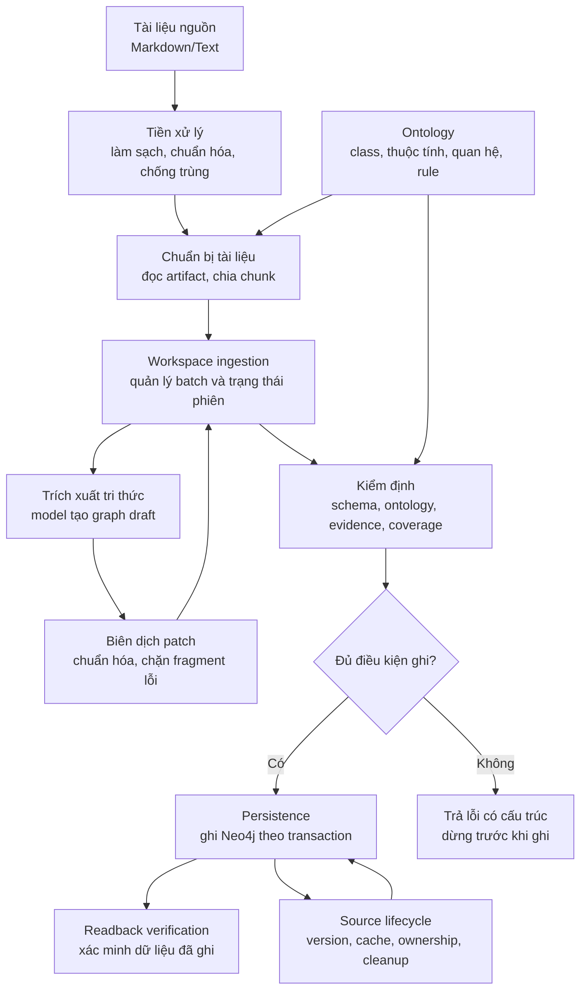
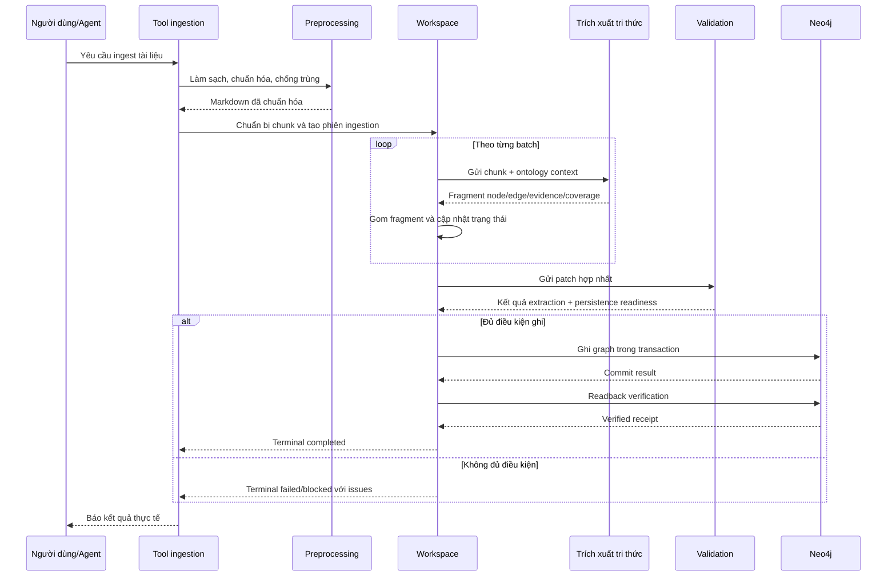
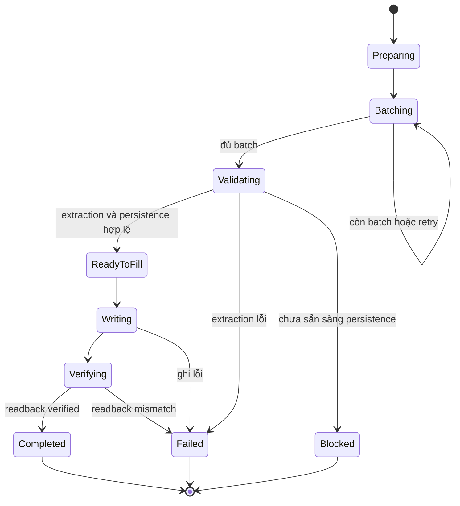

# Tài Liệu Thiết Kế Giải Pháp Ingestion

## 1. Mục Đích Tài Liệu

Tài liệu này mô tả thiết kế giải pháp cho pipeline ingestion: từ tài liệu nghiệp vụ dạng Markdown/text đến Knowledge Graph trên Neo4j. Nội dung tập trung vào các phase xử lý, luồng dữ liệu, cổng kiểm định, trạng thái vận hành và tiêu chí hoàn tất.

Tài liệu không nhằm thay thế tài liệu API hoặc mô tả chi tiết từng hàm. Các tên kỹ thuật chỉ được nhắc khi cần làm rõ interface hoặc thuật ngữ cốt lõi, luôn đi kèm diễn giải tiếng Việt.

## 2. Phạm Vi Giải Pháp

| Hạng mục | Trong phạm vi | Ngoài phạm vi |
| --- | --- | --- |
| Ingest tài liệu mới | Đọc, tiền xử lý, chia chunk, trích xuất, kiểm định, ghi graph | Sửa ontology theo nội dung tài liệu |
| Validate-only | Kiểm tra bản nháp graph trước khi ghi | Bỏ qua lỗi grounding hoặc schema |
| Extract-only | Trích xuất graph có evidence và coverage | Cam kết dữ liệu đã ghi Neo4j |
| Update/delete nguồn | Quản lý vòng đời source, cache, cleanup dữ kiện không còn nguồn hỗ trợ | Xóa thủ công dữ liệu không qua ownership nguồn |
| Preprocessing | Làm sạch, chuẩn hóa, chống trùng, kiểm tra cấu trúc Markdown | Biên tập nghiệp vụ hoặc tự sinh facts bị thiếu |

## 3. Bối Cảnh Và Bài Toán

Hệ thống cần biến tài liệu nghiệp vụ sản phẩm thành tri thức có cấu trúc để truy vấn trong Product Sales Knowledge Graph. Tài liệu nguồn thường dài, có bảng Markdown, đoạn mô tả, điều kiện nghiệp vụ, hạn mức, hồ sơ yêu cầu và các thông tin sản phẩm.

Thách thức chính:

- Tài liệu dài cần xử lý theo batch nhưng kết quả cuối phải nhất quán.
- Mọi dữ kiện ghi vào graph phải có bằng chứng nguồn nguyên văn.
- Không được tự bịa dữ liệu để thỏa ontology hoặc rule persistence.
- Cần phân biệt bản nháp trích xuất hợp lệ với dữ liệu đủ điều kiện ghi.
- Update/delete phải bảo toàn dữ kiện còn được tài liệu khác hỗ trợ.

## 4. Kiến Trúc Tổng Quan

Các interface công khai dùng ở tầng agent/tool:

| Tên kỹ thuật | Diễn giải tiếng Việt | Khi dùng |
| --- | --- | --- |
| `ingest_document_end_to_end` | Công cụ chạy ingestion trọn pipeline | Ingest/import/load tài liệu mới và cần kết quả terminal |
| `update_document` | Công cụ cập nhật nguồn đã ingest | Thay thế nội dung một tài liệu logic đã tồn tại |
| `delete_document` | Công cụ xóa quyền sở hữu nguồn | Ngừng hiệu lực nguồn và dọn dữ kiện không còn nguồn hỗ trợ |
| `apply_changes` | Công cụ áp dụng tập thay đổi nhiều nguồn | Đồng bộ nhiều file thêm/sửa/xóa trong một lần |
| `validate_graph_patch` | Công cụ kiểm định bản nháp graph | Validate-only hoặc kiểm tra patch do caller cung cấp |
| `fill_graph_patch` | Công cụ ghi patch đã được xác thực trong cùng phiên | Ghi dữ liệu sau khi đã qua validation gate |

## 5. Luồng Xử Lý Theo Phase

| Phase | Mục tiêu | Đầu vào | Đầu ra | Cổng kiểm soát |
| --- | --- | --- | --- | --- |
| 0. Nạp ontology | Có nguồn sự thật cho class, thuộc tính, quan hệ, datatype, rule | Ontology JSON/cấu hình graph | Registry tra cứu ontology | Ontology chỉ đọc, không tự sửa để khớp tài liệu |
| 1. Tiền xử lý | Làm tài liệu sạch và ổn định trước khi chunk | Markdown/text thô | Markdown đã chuẩn hóa | Không làm mất facts; chống trùng trước/sau normalize |
| 2. Chuẩn bị ngữ cảnh | Đọc artifact và chia tài liệu thành chunk | Tài liệu đã xử lý, ontology context | Danh sách chunk có chỉ số, source, section | Chunk phải đủ để kiểm tra coverage |
| 3. Trích xuất tri thức | Tạo bản nháp graph từ từng batch | Chunk, ontology context, graph context rút gọn | Fragment/bản nháp node-edge-evidence | Không tạo facts ngoài nguồn |
| 4. Biên dịch patch | Chuẩn hóa cấu trúc graph draft | Fragment từ model | Patch hợp nhất có fingerprint | Chặn temp id trùng, edge treo, xung đột deterministic |
| 5. Kiểm định | Đánh giá extraction và readiness | Patch, artifact digest, source chunks | Kết quả `validForExtraction` và `validForPersistence` | Schema, ontology, evidence, coverage, identity, rule bắt buộc |
| 6. Ghi và xác minh | Ghi graph vào Neo4j và đọc lại xác nhận | Patch đã qua validation gate | Commit receipt, node/edge count, verification status | Chỉ ghi khi fingerprint khớp phiên hiện tại |
| 7. Quản lý nguồn | Duy trì lifecycle tài liệu | Document id, version, thay đổi thêm/sửa/xóa | Source version, cache, cleanup facts | Không xóa facts còn nguồn khác hỗ trợ |

### Phase 0: Nạp Ontology Và Quy Tắc Nghiệp Vụ

Ontology là nguồn sự thật cho miền tri thức. Pipeline dùng ontology để biết loại node nào hợp lệ, thuộc tính nào thuộc class nào, quan hệ nào nối được giữa các class, datatype nào cần kiểm tra và rule nào bắt buộc trước khi ghi.

Nguyên tắc thiết kế:

- Ontology chỉ đọc trong quá trình ingestion.
- Tài liệu nguồn không được làm phát sinh class/property/edge mới ngoài ontology.
- Rule runtime-managed được hệ thống quản lý, không bắt model bịa giá trị từ nguồn.

### Phase 1: Tiền Xử Lý Tài Liệu

Phase tiền xử lý chuẩn hóa tài liệu trước khi đi vào ingestion chính.

Các bước chính:

1. Chống trùng dòng thô để loại bỏ lặp nội dung cơ học.
2. Làm sạch Markdown, ký tự rác, khoảng trắng và cấu trúc không ổn định.
3. Chuẩn hóa tên thuộc tính, alias và định dạng giá trị khi có cấu hình.
4. Chống trùng sau chuẩn hóa để loại bỏ các facts lặp về mặt biểu diễn.
5. Kiểm tra cấu trúc Markdown và cảnh báo/lỗi nếu tài liệu không đạt chất lượng tối thiểu.

Đầu ra của phase này là văn bản ổn định hơn, giúp chunking và evidence matching chính xác hơn.

### Phase 2: Chuẩn Bị Tài Liệu Và Chia Ngữ Cảnh

Tài liệu được đọc từ artifact, chuyển thành các chunk có metadata nguồn. Mỗi chunk có chỉ số để dùng trong coverage và evidence.

Yêu cầu:

- Mỗi chunk phải có định danh vị trí rõ ràng.
- Section nếu có phải được giữ để hỗ trợ truy vết.
- Nội dung chunk phải đủ nguyên văn để validation kiểm tra evidence.

### Phase 3: Trích Xuất Tri Thức Thành Bản Nháp Graph

Model trích xuất tri thức từ từng batch thành bản nháp graph. Bản nháp này gồm node, property, edge, evidence và coverage.

Nguyên tắc:

- Chỉ trích xuất facts được nêu hoặc suy ra rõ ràng từ nguồn.
- Mỗi property cần evidence riêng; evidence của node không tự động chứng minh mọi property.
- Mỗi edge cần evidence thể hiện quan hệ, không chỉ hai thực thể xuất hiện gần nhau.
- Chunk có facts nghiệp vụ phải được đánh dấu đã map; chunk không liên quan phải có lý do.

### Phase 4: Chuẩn Hóa, Biên Dịch Và Bảo Vệ Fragment

Các fragment được gom và chuẩn hóa thành patch nội bộ. Phase này bảo vệ pipeline khỏi lỗi cấu trúc trước khi kiểm định sâu.

Kiểm soát chính:

- Không cho phép duplicate temp id.
- Không cho phép edge trỏ tới node không tồn tại.
- Chuẩn hóa property entry thành dạng nội bộ ổn định.
- Tạo fingerprint để ràng buộc patch với source, evidence, ontology và schema version.

### Phase 5: Kiểm Định Schema, Ontology, Evidence, Coverage

Validation tạo hai quyết định:

| Quyết định | Ý nghĩa | Hành động |
| --- | --- | --- |
| `validForExtraction` - hợp lệ để trích xuất | Patch đúng schema, đúng ontology, đủ evidence và coverage | Có thể trả kết quả extract-only hoặc xét tiếp persistence |
| `validForPersistence` - sẵn sàng để ghi | Patch đã qua extraction và thỏa rule ghi graph, identity, readiness | Có thể ghi Neo4j nếu fingerprint còn hiệu lực |

Các nhóm kiểm định:

- Schema: cấu trúc patch, field bắt buộc, field thừa.
- Ontology: class/property/edge tồn tại, domain/range/datatype đúng.
- Evidence: excerpt phải xuất hiện nguyên văn trong chunk được trỏ tới.
- Coverage: mỗi chunk có đúng một quyết định; chunk `MAPPED` phải có evidence.
- Identity: node phải định danh được bằng strategy hợp lệ.
- Persistence readiness: đủ rule bắt buộc để ghi ổn định.

### Phase 6: Ghi Neo4j Và Xác Minh Readback

Khi patch đạt điều kiện ghi, hệ thống ghi node/edge trong một transaction và đọc lại để xác minh.

Một ingestion persistence chỉ được xem là thành công khi có đủ:

- `success = true` - kết quả thành công.
- `stage = completed` - pipeline ở trạng thái hoàn tất.
- `commitStatus = committed` - đã commit vào Neo4j.
- `verificationStatus = verified` - readback xác nhận đúng.
- Số node ghi lớn hơn 0.

Nếu readback mismatch sau commit, hệ thống báo lỗi xác minh; không được mô tả là rollback thành công.

### Phase 7: Quản Lý Vòng Đời Nguồn

Nguồn tài liệu được quản lý theo document id và version. Điều này cho phép update/delete an toàn.

| Nghiệp vụ | Thiết kế xử lý |
| --- | --- |
| Thêm tài liệu mới | Tạo source version mới, ingest, validate, ghi, xác minh, đánh dấu committed |
| Cập nhật tài liệu | Tạo pending version, tái dùng cache fragment khi hợp lệ, ghi version mới sau xác minh |
| Xóa tài liệu | Gỡ ownership của nguồn và chỉ dọn facts không còn nguồn khác hỗ trợ |
| Đồng bộ nhiều thay đổi | Nhận danh sách added/modified/deleted và xử lý trong một operation |

## 6. Sequence Ingest End-To-End

## 7. Trạng Thái Và Điều Kiện Dừng

| Trạng thái/điều kiện | Ý nghĩa | Có được xem là hoàn tất? |
| --- | --- | --- |
| Đang batching | Còn batch chưa xử lý hoặc còn retry | Không |
| Ready to finalize | Đã gom batch nhưng chưa validation/finalize xong | Không |
| Extraction invalid | Bản trích xuất sai hoặc thiếu coverage/evidence | Có, nhưng là terminal thất bại |
| Persistence not ready | Extraction đúng nhưng chưa đủ điều kiện ghi | Có, nhưng chưa ghi graph |
| Completed | Đã ghi và readback verified | Có |

## 8. Thiết Kế Dữ Liệu Đầu Vào/Đầu Ra

| Dữ liệu | Diễn giải | Ghi chú kiểm soát |
| --- | --- | --- |
| Artifact nguồn | File Markdown/text do người dùng cung cấp | Là căn cứ duy nhất cho facts nghiệp vụ |
| Chunk | Đơn vị ngữ cảnh được đánh số | Mỗi chunk phải có quyết định coverage |
| `GraphPatchDraft` - bản nháp thay đổi graph | Payload model-visible gồm node, edge, evidence, coverage | Chưa phải dữ liệu đã ghi |
| Evidence - bằng chứng | Excerpt nguyên văn từ chunk nguồn | Không paraphrase, không ghép dòng rời rạc |
| Coverage - độ phủ nguồn | Quyết định `MAPPED` hoặc `NOT_RELEVANT` cho từng chunk | Thiếu coverage là lỗi extraction |
| Receipt - biên nhận ghi | Kết quả commit, node/edge count, verification status | Dùng để báo persistence thật sự thành công |

## 9. Thuật Ngữ Song Ngữ

| Thuật ngữ | Tiếng Việt | Ý nghĩa ngắn |
| --- | --- | --- |
| Ontology | Bản thể tri thức | Định nghĩa class, thuộc tính, quan hệ, datatype và rule |
| Knowledge Graph | Đồ thị tri thức | Neo4j graph lưu tri thức sản phẩm |
| Ingestion | Nạp tri thức | Pipeline chuyển tài liệu thành graph |
| Artifact | Tài liệu nguồn | File đầu vào được upload hoặc tham chiếu |
| Chunk | Mảnh ngữ cảnh | Phần tài liệu đã chia nhỏ để trích xuất |
| Batch | Lô xử lý | Nhóm chunk được xử lý trong một lượt |
| Graph Patch | Bản thay đổi graph | Tập node/edge/property dự kiến thêm/cập nhật |
| `GraphPatchDraft` | Bản nháp thay đổi graph | Dạng patch model tạo và validation tiếp nhận |
| Evidence | Bằng chứng nguồn | Trích dẫn nguyên văn chứng minh fact |
| Coverage | Độ phủ chunk nguồn | Cam kết chunk đã được xét đến |
| Grounding | Bám nguồn | Mức độ fact được chứng minh bởi evidence |
| Persistence | Ghi bền vững | Ghi dữ liệu vào Neo4j |
| Readback | Đọc lại xác minh | Đọc dữ liệu đã ghi để kiểm tra đúng/sufficient |
| Fingerprint | Dấu vân tay kiểm định | Hash ràng buộc patch với source, ontology, evidence |
| Source lifecycle | Vòng đời nguồn | Quản lý version, trạng thái và ownership tài liệu |

## 10. Xử Lý Lỗi Và Điều Kiện Dừng Chính

| Nhóm lỗi | Dấu hiệu | Cách xử lý |
| --- | --- | --- |
| Extraction invalid | Schema sai, ontology term không tồn tại, evidence không khớp, thiếu coverage | Dừng trước khi ghi; trả issues có vị trí |
| Persistence not ready | Extraction đúng nhưng thiếu rule bắt buộc hoặc identity chưa giải được | Không ghi mặc định; chỉ partial persistence khi được yêu cầu rõ |
| Validation precondition | Patch ghi khác patch đã validate hoặc khác phiên/fingerprint | Dừng ghi; yêu cầu validate lại trong cùng invocation |
| Neo4j write failed | Transaction ghi lỗi | Báo persistence failure; không sửa facts để né lỗi |
| Readback mismatch | Đã commit nhưng dữ liệu đọc lại không khớp | Báo failure ở bước xác minh; không tuyên bố rollback |
| Missing source ownership | Update/delete không tìm thấy nguồn hiện tại | Trả lỗi hoặc bỏ qua theo chính sách `if_missing` |

## 11. Nguyên Tắc Thiết Kế

- Source-grounded first: mọi fact nghiệp vụ phải có bằng chứng nguồn.
- Ontology-driven: ontology quyết định cấu trúc graph hợp lệ.
- Validation-gated persistence: ghi graph chỉ xảy ra sau khi patch đã qua cổng kiểm định.
- Invocation-scoped authorization: validation ở phiên cũ không cấp quyền ghi cho phiên mới.
- Incremental-safe: cập nhật/xóa dựa trên ownership nguồn, tránh xóa facts còn nguồn khác hỗ trợ.
- Terminal honesty: chỉ báo đã ghi graph khi commit và readback đều thành công.

## 12. Tiêu Chí Nghiệm Thu

| Tiêu chí | Cách xác nhận |
| --- | --- |
| Ingest tài liệu mới chạy đến terminal state | Kết quả không còn `remainingBatches`, không còn stage nội bộ |
| Extract-only trả patch hợp lệ | `validForExtraction = true` hoặc có issues rõ ràng |
| Persistence thành công được báo đúng | Có `commitStatus = committed`, `verificationStatus = verified`, node count > 0 |
| Tài liệu dài không bị ingest thiếu | Mỗi prepared chunk có đúng một coverage decision |
| Evidence truy vết được | Mỗi evidence trỏ đúng source, section/chunk và text nguyên văn |
| Update không làm mất dữ liệu ngoài phạm vi | Chỉ facts thuộc nguồn cũ và không còn nguồn khác hỗ trợ bị cleanup |
| Delete an toàn | Source bị deactivate, dữ liệu shared ownership được giữ lại |

